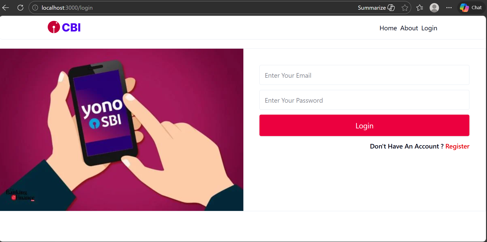
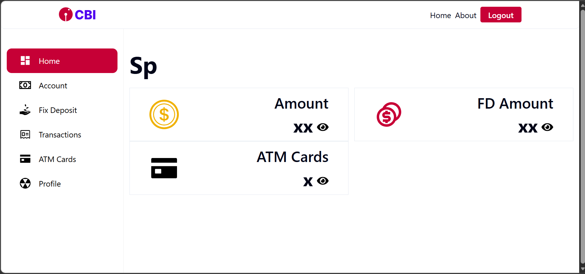
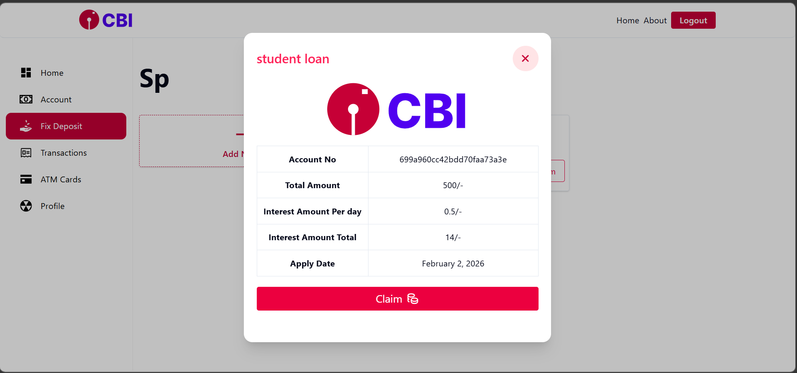
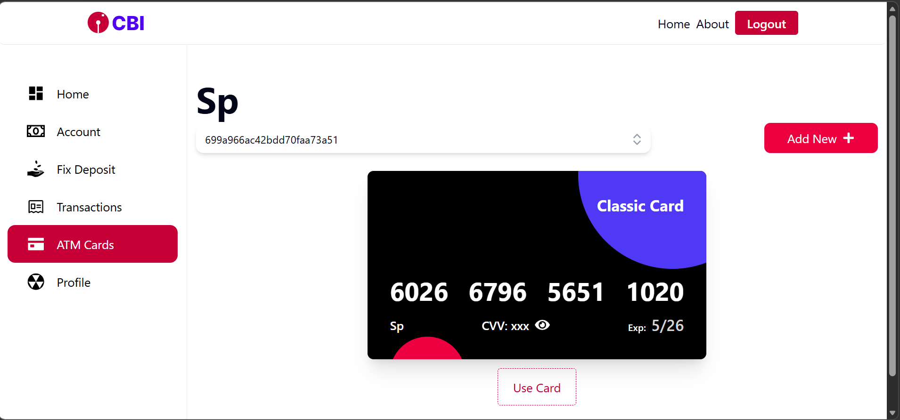
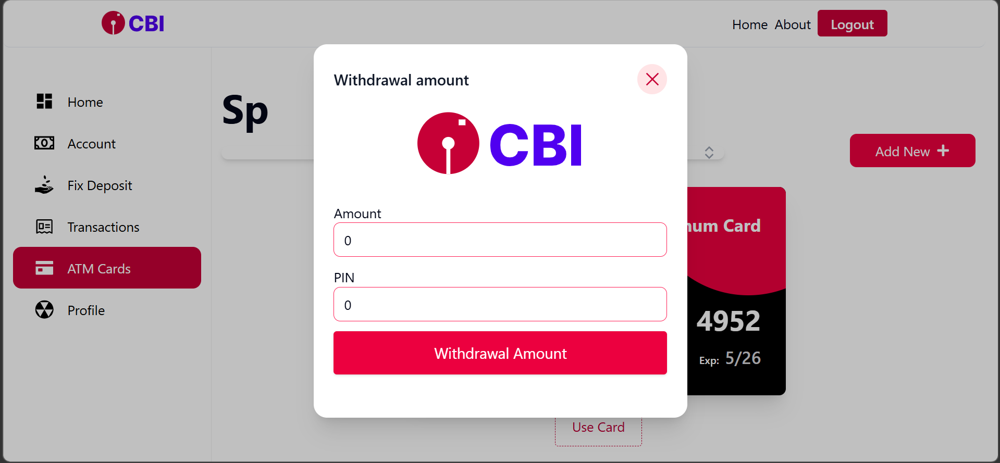

# 💳 Yona (Digital Banking System)

> **A high-performance, full-stack digital banking platform.** Inspired by modern banking ecosystems like YONO SBI, this system simulates complex financial operations with a focus on security, atomicity, and modular architecture.

---
# 🚀 Live Demo

🔗 Live Demo:
👉 https://yona-bank-application.vercel.app/login

## 🚀 Key Modules

### 🔐 Authentication Service
* **User Lifecycle:** Full Registration & Login flow with secure session management.
* **Security:** JWT-based stateless authentication with password hashing via `bcrypt`.
* **Access Control:** Granular protected routes using custom Auth middleware.

### 💳 ATM Card Service
* **Lifecycle:** Virtual ATM card generation (16-digit logic) and real-time status management.
* **Validation:** Built-in logic for card expiry, CVV security, and "Block Card" functionality.

### 💰 Amount Service
* **Transactions:** Secure Deposit, Withdrawal.
* **Integrity:** Implements transaction checks to ensure balances never drop below zero.
* **Logging:** Comprehensive transaction history with ISO timestamps for auditing.

### 🏦 Fixed Deposit (FD) Service
* **Financial Logic:** Compound interest calculation engine based on tenure.
* **Maturity:** Automated computation of maturity amounts and dates.

---

## 🏗 System Architecture

The application follows a **Modular Layered Architecture** (Controller-Service-Model) to ensure industrial-grade maintainability and testability.


| Layer | Responsibility |
| :--- | :--- |
| **Controllers** | Orchestrate HTTP requests and handle API response formatting. |
| **Services** | Core Business Logic — contains calculations and banking rules. |
| **Models** | Mongoose schemas ensuring Data Integrity and Validation. |
| **Middleware** | Centralized Auth guards and Global Error Handling. |
| **Frontend** | React-based UI with Redux Toolkit for global state. |

---

## 🛠 Tech Stack

* **Database:** MongoDB (NoSQL)
* **Backend:** Node.js & Express.js
* **Frontend:** React.js
* **State Management:** Redux Toolkit / Context API
* **Security:** JWT, bcrypt, Dotenv

---

## 📸 Screenshots

Below are the visual previews of the Digital Banking System.

<br>

**1. Secure Authentication** *Login and Registration pages with JWT protection.* 

<br>

**2. User Dashboard** *Real-time balance tracking and transaction overview.* 

<br>

**3. FD Claim** 



<br>

**4. ATM & Banking Services** *Interface for card management.* 



## 📂 Project Structure

```text
Yona-banking-application/
├── backend/
│   ├── src/
│   │   ├── config/          # Database connection & Environment setup
│   │   ├── controllers/     # Request handlers (auth, atm, amount, fd controllers)
│   │   ├── middleware/      # JWT verification & error handling logic
│   │   ├── models/          # Mongoose Schemas (User, Account, Transaction, Card)
│   │   ├── routes/          # API Route definitions
│   │   ├── services/        # Business Logic (Interest calculation, Fund transfers)
│   │   ├── utils/           # Helper functions (Token generators, ID formatters)
│   │   └── validation/      # Input validation logic (Joi/Zod schemas)
│   ├── server.js            # Server entry point
│   └── package.json         # Backend dependencies
│
├── frontend/
│   ├── src/
│   │   ├── app/             # Main application pages
│   │   ├── components/      # Reusable UI components
│   │   ├── context/         # Global React Context providers
│   │   ├── layout/          # Page wrappers
│   │   ├── lib/             # Axios instance & API configuration
│   │   ├── redux/           # Redux Slices & Store configuration
│   │   └── utils/           # Frontend helpers
│   └── package.json         # Frontend dependencies
│
├── screenshots/             # Application UI previews
├── README.md                # Project documentation
└── .gitignore               # Ignored files
```
## ⚙️ Installation & Setup

1. Clone the Repository
```env
git clone https://github.com/Shreyash-Pathare/Yona-Banking-Application.git
```
2. Backend Configuration
```env
cd backend
npm install
```
Create a .env file in the backend folder:
```env
MONGO_URI=<mongodb URI>
PORT=1234

STRIPE_SECRET_KEY=<your_stripe_secret_key>

FRONTEND_URI=http://localhost:3000
```
```env
npm start
```
3. Frontend Configuration
``` env
cd frontend
npm install
```
Create a .env file in the frontend folder:
```env
NEXT_PUBLIC_BASE_URI=http://localhost:1234/api/v1

NEXT_PUBLIC_STRIPE_PUBLISHABLE_KEY=<your_stripe_publishable_key>
```
```env
npm start
```

## 📈 Future Roadmap  

✅ Admin Panel: Role-based access for bank managers.

✅ Security: Rate limiting to prevent brute force attacks.

✅ Performance: Redis caching for balance inquiries.


## 👨‍💻 Author

Shreyash Pathare  
GitHub: https://github.com/Shreyash-Pathare
